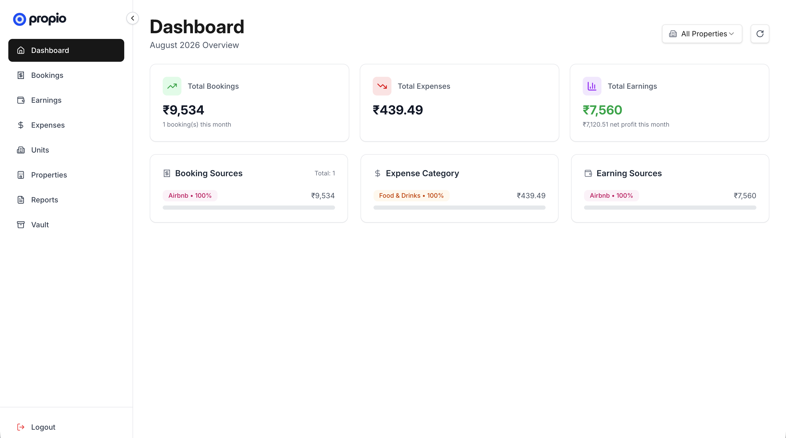
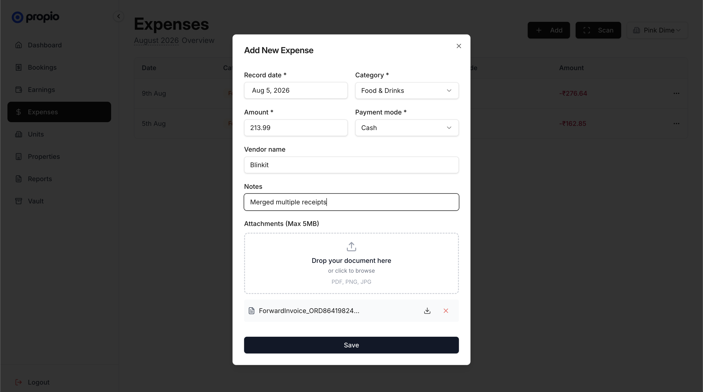
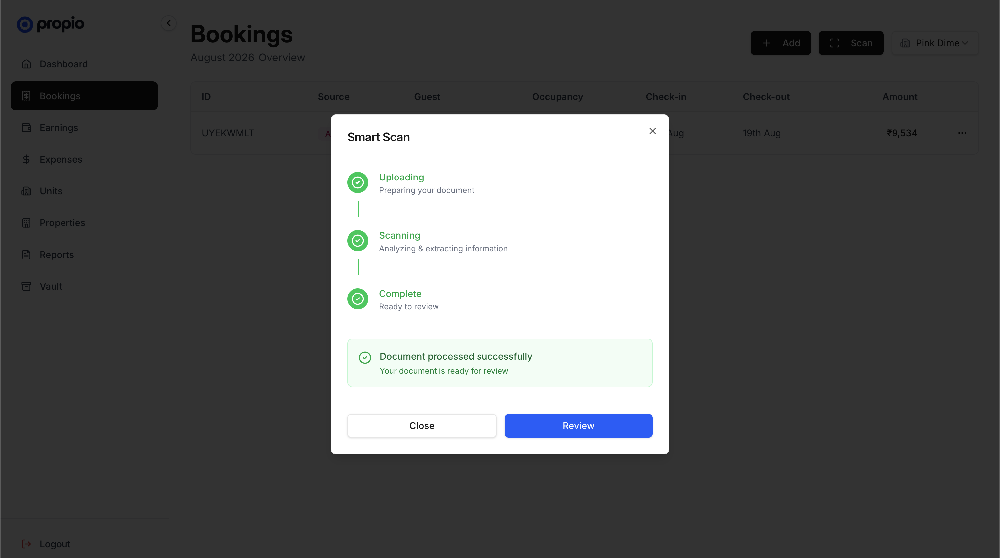

# Propio AI

**Financial Management Platform for Short-Term Rental Operators**

Propio AI helps homestay, villa, and short-term rental operators replace spreadsheets with a simple, purpose-built platform for tracking bookings, expenses, and revenue across all their properties. No accounting jargon. No complex PMS software. Just clarity.


---

## What It Does

Propio is built for property owners managing multiple properties who currently rely on Excel sheets, WhatsApp, and scattered receipts to manage their finances. It provides:

- **Booking Management** — Log direct, Airbnb, OTA, and agent bookings per property with guest details, check-in/check-out dates, and payment tracking.
- **Expense Tracking** — Record property-wise expenses across 14 categories (electricity, maintenance, salary, platform fees, etc.) with optional receipt attachment.
- **Earnings Tracking** — Track revenue per property with source attribution and payment mode breakdowns.
- **Smart Scan (AI-Powered OCR)** — Upload a receipt, invoice, or booking confirmation and let AI extract all financial fields automatically and categorize the transaction type.
- **Monthly Property Reports** — Period-wise summaries of income vs. expenses per property, ready for accountant handoff.
- **Document Vault** — Secure storage for property agreements, leases, NOCs, and compliance documents.
- **Data Export** — Excel exports for accountant-ready reconciliation and GST filing preparation.

<br>



---

## How It Works — AI-Powered Document Intelligence

The **Smart Scan** feature is the core intelligence layer. It eliminates tedious manual data entry by turning any receipt, invoice, or booking confirmation into structured, actionable financial records.

```
┌──────────────────────┐
│    User drops a      │
│      document        │
└──────────┬───────────┘
           │
           ▼
┌──────────────────────┐
│    Secure File       │
│      Storage         │
└──────────┬───────────┘
           │
           ▼
┌──────────────────────┐
│    AI Document       │
│     Analysis         │
└──────────┬───────────┘
           │
           ▼
┌──────────────────────┐
│    Pre-filled        │
│    Form Review       │
└──────────────────────┘
```

<br>



### The Pipeline

1. **Document Upload** — The user drops a receipt or invoice (PDF, PNG, JPG) into the Smart Scan dialog. The file is streamed directly to cloud object storage — no file size bottlenecks, no browser memory issues.

2. **Asynchronous Task Dispatch** — A background processing task is created and the task ID is returned instantly. The user sees a real-time progress stepper while the AI works — no frozen UI, no loading spinners with no context.

3. **AI-Powered Extraction** — The document is analyzed by Google Gemini with carefully engineered system prompts and enforced JSON schema output. The AI agent:
    - Reads multi-page documents and identifies the relevant financial data
    - Extracts dates, amounts, vendor/guest names, and payment methods
    - Automatically categorizes the expense type or booking source
    - Normalizes all values (date formats, currency amounts, business names)
    - Rejects non-financial documents with a clear error instead of hallucinating data

4. **Multi-Model Resilience** — The system chains multiple AI models with automatic fallback. If one model is rate-limited or unavailable, the request seamlessly cascades to the next model with exponential backoff — ensuring near-zero downtime for the end user.

5. **Review & Confirm** — Extracted data pre-fills the expense or booking form. The user reviews, adjusts if needed, and saves — turning a 2-minute manual entry into a 5-second review.

<br>



### Why This Approach

- **Schema-enforced structured output** — The AI doesn't return free-text. Every response is constrained to a strict JSON schema with typed fields and enum-validated categories. This eliminates parsing failures and ensures consistent, reliable data extraction.
- **Fire-and-forget with polling** — Document processing runs asynchronously on the server. The client polls for completion, keeping the UX responsive and HTTP connections short-lived.
- **Full observability** — Every AI task is logged with token consumption, processing duration, and status transitions — enabling cost tracking and performance monitoring at scale.
- **Strict extraction discipline** — The AI is explicitly instructed to never guess or fabricate values. Missing fields return null rather than hallucinated data, preserving data integrity for financial records.

---

## Tech Stack

| Layer                | Technology                            |
| -------------------- | ------------------------------------- |
| **Backend**          | Express.js (v5) with Node.js          |
| **Frontend**         | React 19 + React Router 7 (Vite)      |
| **Database**         | MongoDB (Mongoose ODM)                |
| **AI / OCR**         | Google Gemini API                     |
| **Object Storage**   | Cloudflare R2 (S3-compatible)         |
| **Email**            | Resend                                |
| **Styling**          | Tailwind CSS v4 + Radix UI primitives |
| **State Management** | TanStack React Query                  |
| **Auth**             | JWT + OTP-based email verification    |

---

## Project Structure

This is an **npm workspaces monorepo** with two packages:

```
propio/
├── api/                    # Express.js REST API
│   ├── agents/             # AI agents (OCR document parsing)
│   ├── constants/          # Enums and business constants
│   ├── controllers/        # Route handlers
│   ├── infrastructure/     # External service clients (AI, Storage, DB, Mail)
│   ├── middlewares/        # Auth, CORS, logging, sanitization
│   ├── models/             # Database schemas
│   ├── routes/             # API route definitions
│   ├── services/           # Business logic layer
│   ├── templates/          # Email templates
│   ├── utils/              # Shared utilities
│   └── server.js           # Application entry point
│
├── web/                    # React frontend (SPA)
│   ├── app/
│   │   ├── components/     # UI components + shared components
│   │   ├── contexts/       # Auth context provider
│   │   ├── hooks/          # Custom React hooks
│   │   ├── lib/            # API client, utilities
│   │   ├── routes/         # Page components
│   │   ├── services/       # API service layer
│   │   └── types.ts        # TypeScript type definitions
│   └── public/             # Static assets, favicons
│
├── package.json            # Root workspace config
├── .npmrc                  # npm configuration
└── .gitignore
```

---

## Getting Started

### Prerequisites

- Node.js 20+
- MongoDB instance
- Cloudflare R2 bucket (or any S3-compatible storage)
- Google Gemini API key

### Installation

```bash
# Clone the repository
git clone <repo-url>
cd propio

# Install all workspace dependencies
npm install
```

### Environment Variables

Create `api/.env` using `api/.env.example` as reference.

### Development

```bash
# Run both API and web dev servers
npm run dev

# Run individually
npm run dev:api        # API on port 3000
npm run dev:web        # Web on port 5173
```

### Production Build

```bash
npm run build:web      # Build frontend for production
npm run start:api      # Start API server
npm run start:web      # Serve built frontend
```
